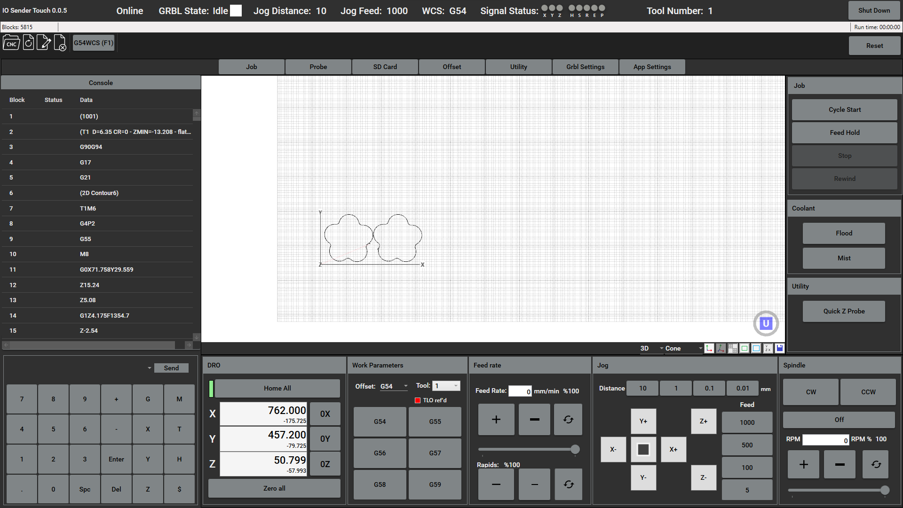
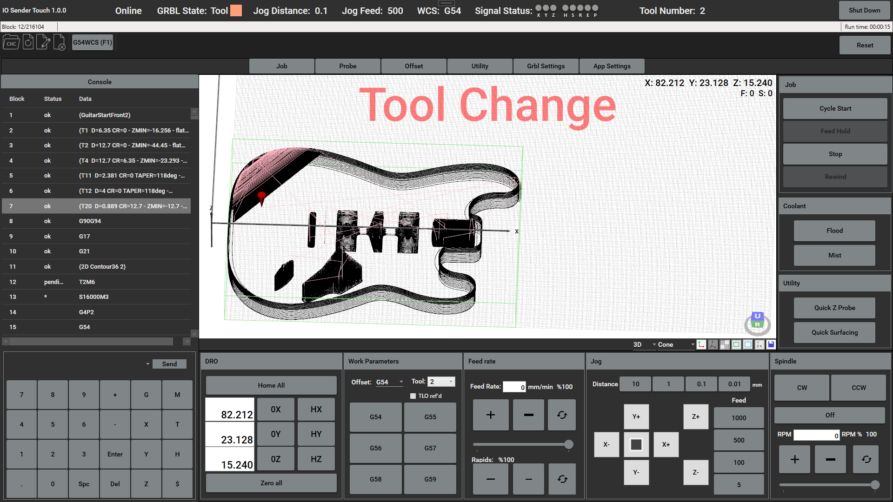
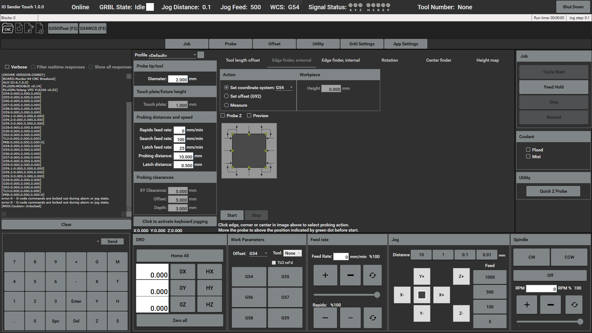
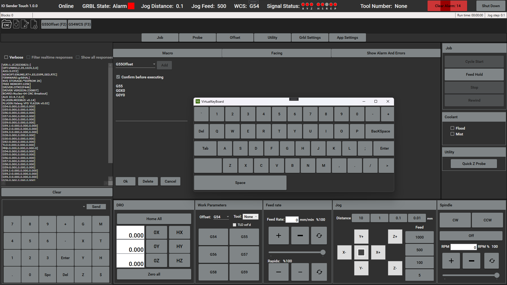
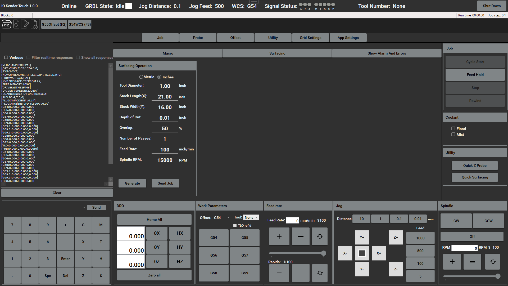
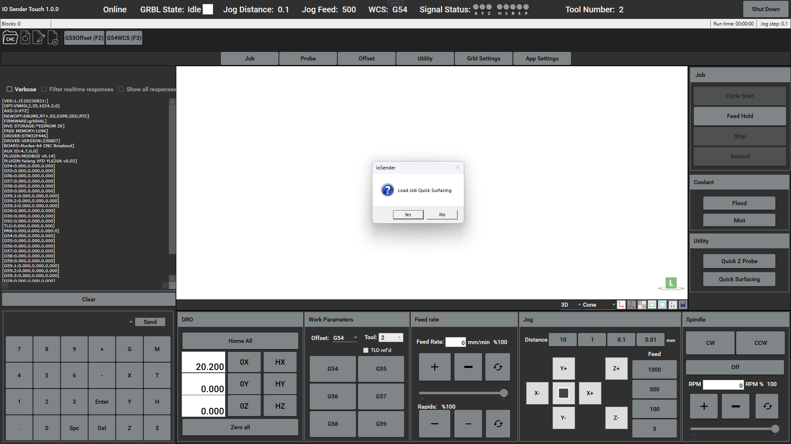
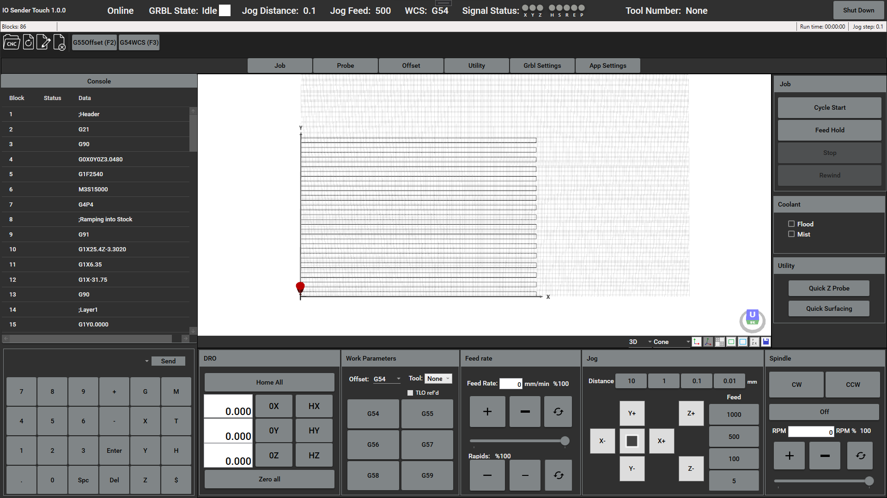

# ioSender Touch - a gcode sender based on Terjeio  [ioSender](https://github.com/terjeio/ioSender) for grblHAL

Goal was to create a application that will run on a cheap mini PC with a UI design that is touch monitor friendly, and will not require a mouse or keyboard to use.
  
---

Changes in UI 

Probing carried over from ioSender 

Double clicking Text Fields in Utility -> Macro tab brings up virtual keyboard 

Material Surface Feature 
 
Saves settings to app config and Gcode to NC file named QuickSurface 

Creates Button on  Home Screen in Utility Section to run the job 

  
---

### Priority issues and work
~~Reset button and logic needs to be added~~ (8/26/23 Implemented needs more testing)
 
~~Virtual keyboard support for probing ui (8/26/23 Implemented)~~
 
~~Finish utility section for material surfacing~~ (8/22/23 Implemented needs more testing)
 
-Create axis alignment/squaring helper under utility 
 
-Add support for portrait orientation 
  
